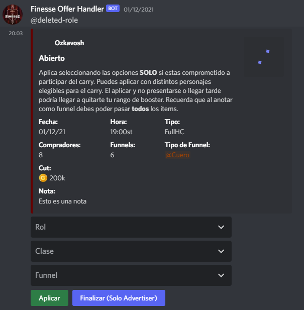
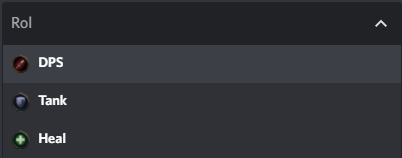
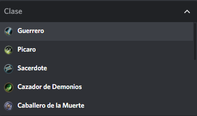
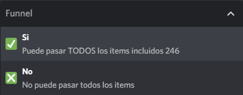
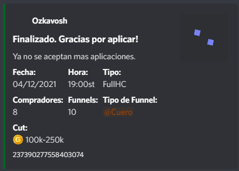
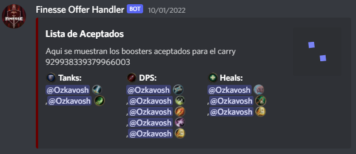

# Finesse Offer Handler

Bot de **Discord** básico creado para simular aplicaciones a un "carry" del juego World of Warcraft. Fue creado cuando todavia no tenía conocimientos en Javascript ni Nodejs a base de tutoriales de Youtube por lo que próximamente me gustaría crear una una versión optimizada aunque ya no se utilice.


## Comandos

```bash
  -set_carry ...args
```

Descripción: Envia un formulario de aplicación al carry, incluyendo nombre y foto del usuario que envió el comando.
Argumentos: fecha, hora, tipo, cantidad_compradores, cantidad_funnels, tipo_funnel, cut, notas

Vista Previa:

- Embed
    
- Roles
    
- Clases
    
- Funnel
    
- Embed Finalizado
    

```bash
  -lista_aceptados arg*
```

*: requerido

Descripción: Muestra la lista de aceptados para el carry determinado por su id, organiza por roles.
Argumentos: id_carry*

Vista Previa:

- Embed
    

## Autor

- [Augusto Silva](https://www.github.com/ozkavosh)

